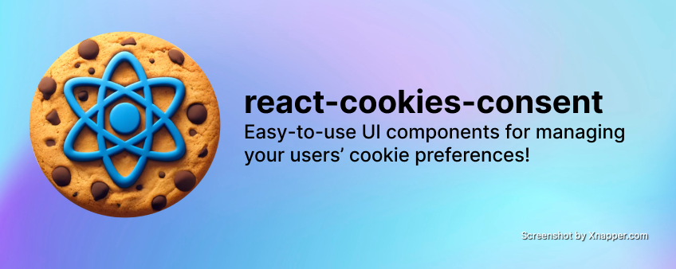
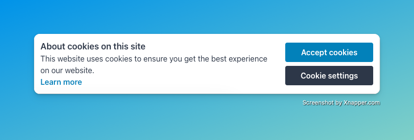
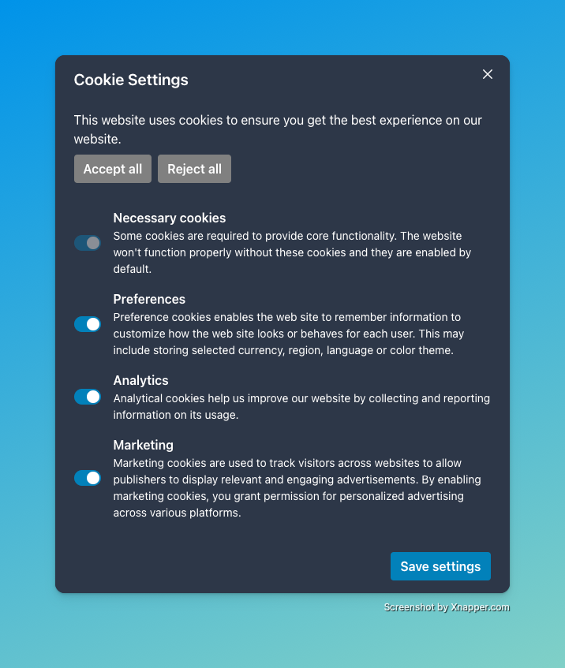

<p align="center">
  
</p>

# react-cookies-consent

[npm_url]: https://www.npmjs.org/package/@caish-cloud/react-cookies-consent

[][npm_url]
[][npm_url]
[][npm_url]

Introducing a comprehensive and customizable solution for managing cookie consent in your React applications! Our package includes a set of powerful components designed to make the implementation of cookie consent straightforward and compliant with user preferences.

Key Features:

- 🔔 <b>`<CookiesConsentAlert />`</b>: Jumpstart user interaction with a simple alert at the bottom of the screen that asks users to confirm their cookie preferences, such as accepting all cookies or choosing which to accept and decline. This component is designed to be non-intrusive yet clear to ensure immediate understanding from the user.
- 📃 <b>`<CookiesConsentModal />`</b>: Provide users with detailed control over their cookie preferences. This modal allows for granular settings adjustments, giving users the power to manage their privacy preferences effectively.
- ✨ <b>Customization</b>: Tailor the appearance and behavior of your cookie consent components to match your application’s theme and branding. Supports both light and dark modes, ensuring a seamless integration regardless of your UI design.
- 📱 <b>Responsive</b>: Looks great on desktop, tablet, and mobile.

Whether you are looking to ensure compliance, improve user experience, or both, our react-cookies-consent components package offers the tools you need to integrate cookie consent functionality into your applications effortlessly!

## Prerequisites

### Storing User Preferences

This library is only for saving you the time for developing the components
necessary to give the user control over their cookie preferences. You will have
to manage the actual preferences of the user by storing in your database,
local storage, etc. So please be sure you already have this in place or will
plan to!

## Table of contents

- [react-cookies-consent](#react-cookies-consent)
  - [Prerequisites](#prerequisites)
  - [Table of contents](#table-of-contents)
  - [Installation](#installation)
  - [Usage](#usage)
    - [Alert](#alert)
      - [Light Theme](#light-theme)
      - [Dark Theme](#dark-theme)
    - [Modal](#modal)
      - [Light Theme](#light-theme-1)
      - [Dark Theme](#dark-theme-1)
  - [Props](#props)
    - [`<CookiesConsentAlert />`](#cookiesconsentalert-)
      - [`<CookiesConsentAlert.Actions />`](#cookiesconsentalertactions-)
      - [`<CookiesConsentAlert.Button />`](#cookiesconsentalertbutton-)
      - [`<CookiesConsentAlert.Content />`](#cookiesconsentalertcontent-)
      - [`<CookiesConsentAlert.Description />`](#cookiesconsentalertdescription-)
      - [`<CookiesConsentAlert.Title />`](#cookiesconsentalerttitle-)
    - [`<CookiesConsentModal />`](#cookiesconsentmodal-)
      - [`<CookiesConsentModal.Body />`](#cookiesconsentmodalbody-)
      - [`<CookiesConsentModal.Button />`](#cookiesconsentmodalbutton-)
      - [`<CookiesConsentModal.CookieActions />`](#cookiesconsentmodalcookieactions-)
        - [`<CookiesConsentModal.CookieAction />`](#cookiesconsentmodalcookieaction-)
      - [`<CookiesConsentModal.CtaActions />`](#cookiesconsentmodalctaactions-)
      - [`<CookiesConsentModal.Footer />`](#cookiesconsentmodalfooter-)
      - [`<CookiesConsentModal.Header />`](#cookiesconsentmodalheader-)
      - [`<CookiesConsentModal.Text />`](#cookiesconsentmodaltext-)
  - [Refs](#refs)
    - [`<CookiesConsentAlert />`](#cookiesconsentalert--1)
    - [`<CookiesConsentModal />`](#cookiesconsentmodal--1)
  - [Troubleshooting](#troubleshooting)
  - [Contributing](#contributing)
  - [Built With](#built-with)
  - [Authors](#authors)
  - [License](#license)

## Installation

**BEFORE YOU INSTALL** - please read the [Prerequisites](#prerequisites) section.

To install and set up the library, run:

```sh
npm install @caish-cloud/react-cookies-consent
```

Or if you prefer using Yarn:

```sh
yarn add @caish-cloud/react-cookies-consent
```

## Usage

The usage examples below will get you started with using the alert component
in conjunction with the modal component. You <i>do not</i> have to use both!
You can use one or the other depending on your development needs.

### Alert

This component lives at the bottom of the screen, and will animate in (if chosen
to) to alert the user of their ability to choose their cookie preferences.

The best place to put this is at the root of your project, such as your
providers file, `App.js`, or just somewhere that the user will hit no matter
what page they go to. This is because we want this alert to display on any page
the user navigates to if not the home page for compliance reasons. If this is
not what you need, feel free to put it anywhere!

#### Light Theme

This is the default theme for the component and does not require any additional
configuration.

<p align="center">
  
</p>

```jsx
import { CookiesConsentAlert } from '@caish-cloud/react-cookies-consent';

function ExampleComponent() {
  return (
    <CookiesConsentAlert>
      <CookiesConsentAlert.Content>
        <CookiesConsentAlert.Title text="About cookies on this site" />

        <CookiesConsentAlert.Description text="This website uses cookies to ensure you get the best experience on our website." />

        <CookiesConsentAlert.Button
          onClick={() => {
            // Handle what happens when user clicks on "Learn more" button
          }}
          text="Learn more"
          variant="text"
        />
      </CookiesConsentAlert.Content>

      <CookiesConsentAlert.Actions>
        <CookiesConsentAlert.Button
          onClick={() => {
            // Handle what happens when user accepts all cookies
          }}
          text="Accept cookies"
        />

        <CookiesConsentAlert.Button
          onClick={() => {
            // Handle what happens when user rejects all cookies
          }}
          regularButtonColor="#2D3748"
          shouldShowModal={true}
          text="Cookie settings"
        />
      </CookiesConsentAlert.Actions>
    </CookiesConsentAlert>
  );
}
```

#### Dark Theme

As shown in the code below, you'll need to add the `theme="dark"` parameter to
the root component, and that's it!

<p align="center">
  
</p>

```jsx
import { CookiesConsentAlert } from '@caish-cloud/react-cookies-consent';

function ExampleComponent() {
  return (
    <CookiesConsentAlert theme="dark">
      <CookiesConsentAlert.Content>
        <CookiesConsentAlert.Title text="About cookies on this site" />

        <CookiesConsentAlert.Description text="This website uses cookies to ensure you get the best experience on our website." />

        <CookiesConsentAlert.Button
          onClick={() => {
            // Handle what happens when user clicks on "Learn more" button
          }}
          text="Learn more"
          variant="text"
        />
      </CookiesConsentAlert.Content>

      <CookiesConsentAlert.Actions>
        <CookiesConsentAlert.Button
          onClick={() => {
            // Handle what happens when user accepts all cookies
          }}
          text="Accept cookies"
        />

        <CookiesConsentAlert.Button
          onClick={() => {
            // Handle what happens when user rejects all cookies
          }}
          regularButtonColor="grey"
          shouldShowModal={true}
          text="Cookie settings"
        />
      </CookiesConsentAlert.Actions>
    </CookiesConsentAlert>
  );
}
```

### Modal

This component will animate in to the center or top-middle of the screen to give
the user granular control over their cookie preferences.

The best place to put this is right next to the alert component from this
library. If you're not using the alert component, then you can put this where
you'll need it!

#### Light Theme

This is the default theme for the component and does not require any additional
configuration.

<p align="center">
  
</p>

```jsx
import { CookiesConsentModal } from '@caish-cloud/react-cookies-consent';

function ExampleComponent() {
  return (
    <CookiesConsentModal>
      <CookiesConsentModal.Header text="Cookie Settings" />

      <CookiesConsentModal.Body>
        <CookiesConsentModal.Text text="This website uses cookies to ensure you get the best experience on our website." />

        <CookiesConsentModal.CtaActions>
          <CookiesConsentModal.Button
            onClick={() => {
              // Handle what happens when user accepts all cookies
            }}
            regularButtonColor="#2D3748"
            text="Accept all"
          />

          <CookiesConsentModal.Button
            onClick={() => {
              // Handle what happens when user rejects all cookies
            }}
            regularButtonColor="#2D3748"
            text="Reject all"
          />
        </CookiesConsentModal.CtaActions>

        <CookiesConsentModal.CookieActions>
          <CookiesConsentModal.CookieAction
            description="Some cookies are required to provide core functionality. The website won't function properly without these cookies and they are enabled by default."
            switchDisabled={true}
            switchToggledOn={true}
            title="Necessary cookies"
          />

          <CookiesConsentModal.CookieAction
            description="Preference cookies enables the web site to remember information to customize how the web site looks or behaves for each user. This may include storing selected currency, region, language or color theme."
            onSwitchToggle={(isSwitchOn) => {
              // Handle what happens when user toggles preferences cookies
            }}
            title="Preferences"
          />

          <CookiesConsentModal.CookieAction
            description="Analytical cookies help us improve our website by collecting and reporting information on its usage."
            onSwitchToggle={(isSwitchOn) => {
              // Handle what happens when user toggles analytics cookies
            }}
            title="Analytics"
          />

          <CookiesConsentModal.CookieAction
            description="Marketing cookies are used to track visitors across websites to allow publishers to display relevant and engaging advertisements. By enabling marketing cookies, you grant permission for personalized advertising across various platforms."
            onSwitchToggle={(isSwitchOn) => {
              // Handle what happens when user toggles marketing cookies
            }}
            title="Marketing"
          />
        </CookiesConsentModal.CookieActions>
      </CookiesConsentModal.Body>

      <CookiesConsentModal.Footer>
        <CookiesConsentModal.Button
          onClick={() => {
            // Handle what happens when user saves their cookie settings
          }}
          text="Save settings"
        />
      </CookiesConsentModal.Footer>
    </CookiesConsentModal>
  );
}
```

#### Dark Theme

As shown in the code below, you'll need to add the `theme="dark"` parameter to
the root component, and that's it!

<p align="center">
  
</p>

```jsx
import { CookiesConsentModal } from '@caish-cloud/react-cookies-consent';

function ExampleComponent() {
  return (
    <CookiesConsentModal theme="dark">
      <CookiesConsentModal.Header text="Cookie Settings" />

      <CookiesConsentModal.Body>
        <CookiesConsentModal.Text text="This website uses cookies to ensure you get the best experience on our website." />

        <CookiesConsentModal.CtaActions>
          <CookiesConsentModal.Button
            onClick={() => {
              // Handle what happens when user accepts all cookies
            }}
            regularButtonColor="grey"
            text="Accept all"
          />

          <CookiesConsentModal.Button
            onClick={() => {
              // Handle what happens when user rejects all cookies
            }}
            regularButtonColor="grey"
            text="Reject all"
          />
        </CookiesConsentModal.CtaActions>

        <CookiesConsentModal.CookieActions>
          <CookiesConsentModal.CookieAction
            description="Some cookies are required to provide core functionality. The website won't function properly without these cookies and they are enabled by default."
            switchDisabled={true}
            switchToggledOn={true}
            title="Necessary cookies"
          />

          <CookiesConsentModal.CookieAction
            description="Preference cookies enables the web site to remember information to customize how the web site looks or behaves for each user. This may include storing selected currency, region, language or color theme."
            onSwitchToggle={(isSwitchOn) => {
              // Handle what happens when user toggles preferences cookies
            }}
            title="Preferences"
          />

          <CookiesConsentModal.CookieAction
            description="Analytical cookies help us improve our website by collecting and reporting information on its usage."
            onSwitchToggle={(isSwitchOn) => {
              // Handle what happens when user toggles analytics cookies
            }}
            title="Analytics"
          />

          <CookiesConsentModal.CookieAction
            description="Marketing cookies are used to track visitors across websites to allow publishers to display relevant and engaging advertisements. By enabling marketing cookies, you grant permission for personalized advertising across various platforms."
            onSwitchToggle={(isSwitchOn) => {
              // Handle what happens when user toggles marketing cookies
            }}
            title="Marketing"
          />
        </CookiesConsentModal.CookieActions>
      </CookiesConsentModal.Body>

      <CookiesConsentModal.Footer>
        <CookiesConsentModal.Button
          onClick={() => {
            // Handle what happens when user saves their cookie settings
          }}
          text="Save settings"
        />
      </CookiesConsentModal.Footer>
    </CookiesConsentModal>
  );
}
```

## Props

### `<CookiesConsentAlert />`

This is the root/parent component for the alert. This is required.

#### `containerStyle`

The styles for the container of the alert.

| Required | Type                                                         | Default                                                                         |
| -------- | ------------------------------------------------------------ | ------------------------------------------------------------------------------- |
| False    | `{ dark?: React.CSSProperties, light: React.CSSProperties }` | `{ dark: { backgroundColor: "#2D3748" }, light: { backgroundColor: "white" } }` |

#### Example

```jsx
<CookiesConsentAlert
  containerStyle={{
    dark: {
      backgroundColor: '#2D3748'
    },
    light: {
      backgroundColor: 'white'
    }
  }}
/>
```

---

#### `enterExitAnimation`

How the alert should enter and exit the screen.

| Required | Type                                           | Default         |
| -------- | ---------------------------------------------- | --------------- |
| False    | `"from-bottom" \| "from-left" \| "from-right"` | `"from-bottom"` |

#### Example

```jsx
<CookiesConsentAlert enterExitAnimation="from-left" />
```

---

#### `enterExitAnimationEnabled`

Whether the enter/exit animations for the alert is enabled.

| Required | Type      | Default |
| -------- | --------- | ------- |
| False    | `boolean` | `true`  |

#### Example

```jsx
<CookiesConsentAlert enterExitAnimationEnabled={false} />
```

---

#### `localStorageKeyName`

The key name for the local storage item that stores the alert dismissed state.

| Required | Type     | Default                                   |
| -------- | -------- | ----------------------------------------- |
| False    | `string` | `"react-cookies-consent/alert-dismissed"` |

#### Example

```jsx
<CookiesConsentAlert localStorageKeyName="my-test-key-name" />
```

---

#### `placement`

The placement of the alert on the screen.

| Required | Type                                                 | Default           |
| -------- | ---------------------------------------------------- | ----------------- |
| False    | `"bottom-center" \| "bottom-left" \| "bottom-right"` | `"bottom-center"` |

#### Example

```jsx
<CookiesConsentAlert placement="bottom-left" />
```

---

#### `theme`

The theme for the alert (i.e. light/dark mode).

| Required | Type                | Default   |
| -------- | ------------------- | --------- |
| False    | `"dark" \| "light"` | `"light"` |

#### Example

```jsx
<CookiesConsentAlert theme="dark" />
```

---

### `<CookiesConsentAlert.Actions />`

This is the container for the Call-to-Action (CTA) buttons in the alert, which
can accept these components:

- `<CookiesConsentAlert.Button />`

#### `containerStyle`

The styles for the container of the actions.

| Required | Type                                                         | Default |
| -------- | ------------------------------------------------------------ | ------- |
| False    | `{ dark?: React.CSSProperties, light: React.CSSProperties }` | -       |

#### Example

```jsx
<CookiesConsentAlert>
  <CookiesConsentAlert.Actions
    containerStyle={{
      dark: {
        backgroundColor: '#2D3748'
      },
      light: {
        backgroundColor: 'white'
      }
    }}
  ></CookiesConsentAlert.Actions>
</CookiesConsentAlert>
```

---

### `<CookiesConsentAlert.Button />`

This is a button used within the alert. This component can be used within
these components:

- `<CookiesConsentAlert.Content />`
- `<CookiesConsentAlert.Actions />`

#### `clickAnimationEnabled`

Whether the button should have click animations.

> Note: this is disabled by default when using the `"text"` variant.

| Required | Type      | Default |
| -------- | --------- | ------- |
| False    | `boolean` | `true`  |

#### Example

```jsx
<CookiesConsentAlert>
  <CookiesConsentAlert.Actions>
    <CookiesConsentAlert.Button clickAnimationEnabled={false} />
  </CookiesConsentAlert.Actions>
</CookiesConsentAlert>
```

---

#### `containerStyle`

The styles for the container of the button.

| Required | Type                                                         | Default                                                                           |
| -------- | ------------------------------------------------------------ | --------------------------------------------------------------------------------- |
| False    | `{ dark?: React.CSSProperties, light: React.CSSProperties }` | `{ dark: { backgroundColor: "#0082ba" }, light: { backgroundColor: "#0082ba" } }` |

#### Example

```jsx
<CookiesConsentAlert>
  <CookiesConsentAlert.Actions>
    <CookiesConsentAlert.Button
      containerStyle={{
        dark: {
          backgroundColor: '#2D3748'
        },
        light: {
          backgroundColor: 'white'
        }
      }}
    />
  </CookiesConsentAlert.Actions>
</CookiesConsentAlert>
```

---

#### `hoverAnimationEnabled`

Whether the button should animate when hovered.

| Required | Type      | Default |
| -------- | --------- | ------- |
| False    | `boolean` | `true`  |

#### Example

```jsx
<CookiesConsentAlert>
  <CookiesConsentAlert.Actions>
    <CookiesConsentAlert.Button hoverAnimationEnabled={false} />
  </CookiesConsentAlert.Actions>
</CookiesConsentAlert>
```

---

#### `onClick`

Handles what happens when the button is clicked.

| Required | Type         | Default |
| -------- | ------------ | ------- |
| True     | `() => void` | -       |

#### Example

```jsx
<CookiesConsentAlert>
  <CookiesConsentAlert.Actions>
    <CookiesConsentAlert.Button onClick={() => console.log('clicked')} />
  </CookiesConsentAlert.Actions>
</CookiesConsentAlert>
```

---

#### `regularButtonColor`

The color of the regular variant button.

| Required | Type     | Default     |
| -------- | -------- | ----------- |
| False    | `string` | `"#0082ba"` |

#### Example

```jsx
<CookiesConsentAlert>
  <CookiesConsentAlert.Actions>
    <CookiesConsentAlert.Button
      regularButtonColor="#0082ba"
      variant="regular"
    />
  </CookiesConsentAlert.Actions>
</CookiesConsentAlert>
```

---

#### `shouldDismissAlert`

Whether the alert should be dismissed when the button is clicked.

| Required | Type      | Default |
| -------- | --------- | ------- |
| False    | `boolean` | `true`  |

#### Example

```jsx
<CookiesConsentAlert>
  <CookiesConsentAlert.Actions>
    <CookiesConsentAlert.Button shouldDismissAlert={false} />
  </CookiesConsentAlert.Actions>
</CookiesConsentAlert>
```

---

#### `shouldShowModal`

Whether the modal should be shown when the button is clicked.

| Required | Type      | Default |
| -------- | --------- | ------- |
| False    | `boolean` | `false` |

#### Example

```jsx
<CookiesConsentAlert>
  <CookiesConsentAlert.Actions>
    <CookiesConsentAlert.Button shouldShowModal={true} />
  </CookiesConsentAlert.Actions>
</CookiesConsentAlert>
```

---

#### `text`

The text to display in the button.

| Required | Type     | Default |
| -------- | -------- | ------- |
| True     | `string` | -       |

#### Example

```jsx
<CookiesConsentAlert>
  <CookiesConsentAlert.Actions>
    <CookiesConsentAlert.Button text="Accept All" />
  </CookiesConsentAlert.Actions>
</CookiesConsentAlert>
```

---

#### `textButtonColor`

The color of the text variant button.

| Required | Type     | Default     |
| -------- | -------- | ----------- |
| False    | `string` | `"#00a2e8"` |

#### Example

```jsx
<CookiesConsentAlert>
  <CookiesConsentAlert.Actions>
    <CookiesConsentAlert.Button textButtonColor="#00a2e8" variant="text" />
  </CookiesConsentAlert.Actions>
</CookiesConsentAlert>
```

---

#### `textStyle`

The styles for the button text.

| Required | Type                                                         | Default                                                   |
| -------- | ------------------------------------------------------------ | --------------------------------------------------------- |
| False    | `{ dark?: React.CSSProperties, light: React.CSSProperties }` | `{ dark: { color: "white" }, light: { color: "white" } }` |

#### Example

```jsx
<CookiesConsentAlert>
  <CookiesConsentAlert.Actions>
    <CookiesConsentAlert.Button
      textStyle={{
        dark: {
          color: 'white'
        },
        light: {
          color: '#2D3748'
        }
      }}
    />
  </CookiesConsentAlert.Actions>
</CookiesConsentAlert>
```

---

#### `variant`

The type of button to render.

- `"regular"` - A regular looking button.
- `"text"` - A button that looks like a text link.

| Required | Type                  | Default     |
| -------- | --------------------- | ----------- |
| False    | `"regular" \| "text"` | `"regular"` |

#### Example

```jsx
<CookiesConsentAlert>
  <CookiesConsentAlert.Actions>
    <CookiesConsentAlert.Button variant="text" />
  </CookiesConsentAlert.Actions>
</CookiesConsentAlert>
```

---

### `<CookiesConsentAlert.Content />`

This is the container for the content of the alert, which can accept these
custom components:

- `<CookiesConsentAlert.Button />`
- `<CookiesConsentAlert.Description />`
- `<CookiesConsentAlert.Title />`

This is required.

#### `containerStyle`

The styles for the container of the content.

| Required | Type                                                         | Default |
| -------- | ------------------------------------------------------------ | ------- |
| False    | `{ dark?: React.CSSProperties, light: React.CSSProperties }` | -       |

#### Example

```jsx
<CookiesConsentAlert>
  <CookiesConsentAlert.Content
    containerStyle={{
      dark: {
        backgroundColor: '#2D3748'
      },
      light: {
        backgroundColor: 'white'
      }
    }}
  ></CookiesConsentAlert.Content>
</CookiesConsentAlert>
```

---

### `<CookiesConsentAlert.Description />`

This is the description of the alert.

#### `containerStyle`

The styles for the container of the description.

| Required | Type                                                         | Default |
| -------- | ------------------------------------------------------------ | ------- |
| False    | `{ dark?: React.CSSProperties, light: React.CSSProperties }` | -       |

#### Example

```jsx
<CookiesConsentAlert>
  <CookiesConsentAlert.Content>
    <CookiesConsentAlert.Description
      containerStyle={{
        dark: {
          backgroundColor: '#2D3748'
        },
        light: {
          backgroundColor: 'white'
        }
      }}
    />
  </CookiesConsentAlert.Content>
</CookiesConsentAlert>
```

---

#### `text`

The text to display as the description.

| Required | Type     | Default |
| -------- | -------- | ------- |
| True     | `string` | -       |

#### Example

```jsx
<CookiesConsentAlert>
  <CookiesConsentAlert.Content>
    <CookiesConsentAlert.Description text="This is a description of our cookie consent alert." />
  </CookiesConsentAlert.Content>
</CookiesConsentAlert>
```

---

#### `textStyle`

The styles for the description text.

| Required | Type                                                         | Default                                                     |
| -------- | ------------------------------------------------------------ | ----------------------------------------------------------- |
| False    | `{ dark?: React.CSSProperties, light: React.CSSProperties }` | `{ dark: { color: "white" }, light: { color: "#2D3748" } }` |

#### Example

```jsx
<CookiesConsentAlert>
  <CookiesConsentAlert.Content>
    <CookiesConsentAlert.Description
      textStyle={{
        dark: {
          color: 'white'
        },
        light: {
          color: '#2D3748'
        }
      }}
    />
  </CookiesConsentAlert.Content>
</CookiesConsentAlert>
```

---

### `<CookiesConsentAlert.Title />`

This is the title of the alert.

#### `containerStyle`

The styles for the container of the title.

| Required | Type                                                         | Default |
| -------- | ------------------------------------------------------------ | ------- |
| False    | `{ dark?: React.CSSProperties, light: React.CSSProperties }` | -       |

#### Example

```jsx
<CookiesConsentAlert>
  <CookiesConsentAlert.Content>
    <CookiesConsentAlert.Title
      containerStyle={{
        dark: {
          backgroundColor: '#2D3748'
        },
        light: {
          backgroundColor: 'white'
        }
      }}
    />
  </CookiesConsentAlert.Content>
</CookiesConsentAlert>
```

---

#### `text`

The text to display as the title.

| Required | Type     | Default |
| -------- | -------- | ------- |
| True     | `string` | -       |

#### Example

```jsx
<CookiesConsentAlert>
  <CookiesConsentAlert.Content>
    <CookiesConsentAlert.Title text="Cookie Settings" />
  </CookiesConsentAlert.Content>
</CookiesConsentAlert>
```

---

#### `textStyle`

The styles for the title text.

| Required | Type                                                         | Default                                                     |
| -------- | ------------------------------------------------------------ | ----------------------------------------------------------- |
| False    | `{ dark?: React.CSSProperties, light: React.CSSProperties }` | `{ dark: { color: "white" }, light: { color: "#2D3748" } }` |

#### Example

```jsx
<CookiesConsentAlert>
  <CookiesConsentAlert.Content>
    <CookiesConsentAlert.Title
      textStyle={{
        dark: {
          color: 'white'
        },
        light: {
          color: '#2D3748'
        }
      }}
    />
  </CookiesConsentAlert.Content>
</CookiesConsentAlert>
```

---

### `<CookiesConsentModal />`

This is the root/parent component for the modal. This is required.

#### `closeButtonStyle`

The styles for the close button.

| Required | Type                                                         | Default                                                     |
| -------- | ------------------------------------------------------------ | ----------------------------------------------------------- |
| False    | `{ dark?: React.CSSProperties, light: React.CSSProperties }` | `{ dark: { color: "white" }, light: { color: "#2D3748" } }` |

#### Example

```jsx
<CookiesConsentModal
  closeButtonStyle={{
    dark: {
      color: 'white'
    },
    light: {
      color: '#2D3748'
    }
  }}
/>
```

---

#### `containerStyle`

The styles for the content container of the modal.

| Required | Type                                                         | Default                                                                         |
| -------- | ------------------------------------------------------------ | ------------------------------------------------------------------------------- |
| False    | `{ dark?: React.CSSProperties, light: React.CSSProperties }` | `{ dark: { backgroundColor: "#2D3748" }, light: { backgroundColor: "white" } }` |

#### Example

```jsx
<CookiesConsentModal
  containerStyle={{
    dark: {
      backgroundColor: '#2D3748'
    },
    light: {
      backgroundColor: 'white'
    }
  }}
/>
```

---

#### `onModalClose`

Handles what happens when the modal is closed.

| Required | Type         | Default |
| -------- | ------------ | ------- |
| False    | `() => void` | -       |

#### Example

```jsx
<CookiesConsentModal onModalClose={() => console.log('closed')} />
```

---

#### `overlayBlurAmount`

The amount of blur for the overlay.

| Required | Type     | Default |
| -------- | -------- | ------- |
| False    | `number` | `4`     |

#### Example

```jsx
<CookiesConsentModal overlayBlurAmount={6} />
```

---

#### `overlayBlurEnabled`

Whether the overlay should have a blurred effect.

| Required | Type      | Default |
| -------- | --------- | ------- |
| False    | `boolean` | `true`  |

#### Example

```jsx
<CookiesConsentModal overlayBlurEnabled={false} />
```

---

#### `overlayColor`

The color of the overlay.

| Required | Type     | Default              |
| -------- | -------- | -------------------- |
| False    | `string` | `rgba(0, 0, 0, 0.5)` |

> Note: this is only used when `overlayBlurEnabled` is `false`.

#### Example

```jsx
<CookiesConsentModal
  overlayBlurEnabled={false}
  overlayColor="rgba(255,255,255,0.5)"
/>
```

---

#### `placement`

The placement of the modal on the screen.

| Required | Type                       | Default  |
| -------- | -------------------------- | -------- |
| False    | `"center" \| "middle-top"` | "center" |

#### Example

```jsx
<CookiesConsentModal placement="center" />
```

---

#### `shouldShowCloseButton`

Whether the close button should be shown in the modal.

| Required | Type      | Default |
| -------- | --------- | ------- |
| False    | `boolean` | `true`  |

#### Example

```jsx
<CookiesConsentModal shouldShowCloseButton={false} />
```

---

#### `shouldShowOverlay`

Whether the overlay should be shown when the modal is open.

| Required | Type      | Default |
| -------- | --------- | ------- |
| False    | `boolean` | `true`  |

#### Example

```jsx
<CookiesConsentModal shouldShowOverlay={false} />
```

---

#### `theme`

The theme for the modal (i.e. light/dark mode).

| Required | Type                | Default   |
| -------- | ------------------- | --------- |
| False    | `"dark" \| "light"` | `"light"` |

#### Example

```jsx
<CookiesConsentModal theme="dark" />
```

---

### `<CookiesConsentModal.Body />`

The modal body container that will contain all of the user's content, which can
accept these custom components:

- `<CookiesConsentModal.Button />`
- `<CookiesConsentModal.CookieAction />`
- `<CookiesConsentModal.CookieActions />`
- `<CookiesConsentModal.CtaActions />`
- `<CookiesConsentModal.Text />`

This is required.

#### `containerStyle`

The styles for the modal body container.

| Required | Type                                                         | Default |
| -------- | ------------------------------------------------------------ | ------- |
| False    | `{ dark?: React.CSSProperties, light: React.CSSProperties }` | -       |

#### Example

```jsx
<CookiesConsentModal>
  <CookiesConsentModal.Body
    containerStyle={{
      dark: {
        backgroundColor: '#2D3748'
      },
      light: {
        backgroundColor: 'white'
      }
    }}
  ></CookiesConsentModal.Body>
</CookiesConsentModal>
```

---

### `<CookiesConsentModal.Button />`

This is a button used within the modal. This component can be used within
these components:

- `<CookiesConsentModal.CtaActions />`
- `<CookiesConsentModal.Footer />`

#### `clickAnimationEnabled`

Whether the button should have click animations.

> Note: this is disabled by default when using the `"text"` variant.

| Required | Type      | Default |
| -------- | --------- | ------- |
| False    | `boolean` | `true`  |

#### Example

```jsx
<CookiesConsentModal>
  <CookiesConsentModal.Body>
    <CookiesConsentModal.CtaActions>
      <CookiesConsentModal.Button clickAnimationEnabled={false} />
    </CookiesConsentModal.CtaActions>
  </CookiesConsentModal.Body>
</CookiesConsentModal>
```

---

#### `containerStyle`

The styles for the container of the button.

| Required | Type                                                         | Default                                                                           |
| -------- | ------------------------------------------------------------ | --------------------------------------------------------------------------------- |
| False    | `{ dark?: React.CSSProperties, light: React.CSSProperties }` | `{ dark: { backgroundColor: "#0082ba" }, light: { backgroundColor: "#0082ba" } }` |

#### Example

```jsx
<CookiesConsentModal>
  <CookiesConsentModal.Body>
    <CookiesConsentModal.CtaActions>
      <CookiesConsentModal.Button
        containerStyle={{
          dark: {
            backgroundColor: '#2D3748'
          },
          light: {
            backgroundColor: 'white'
          }
        }}
      />
    </CookiesConsentModal.CtaActions>
  </CookiesConsentModal.Body>
</CookiesConsentModal>
```

---

#### `hoverAnimationEnabled`

Whether the button should animate when hovered.

| Required | Type      | Default |
| -------- | --------- | ------- |
| False    | `boolean` | `true`  |

#### Example

```jsx
<CookiesConsentModal>
  <CookiesConsentModal.Body>
    <CookiesConsentModal.CtaActions>
      <CookiesConsentModal.Button hoverAnimationEnabled={false} />
    </CookiesConsentModal.CtaActions>
  </CookiesConsentModal.Body>
</CookiesConsentModal>
```

---

#### `onClick`

Handles what happens when the button is clicked.

| Required | Type         | Default |
| -------- | ------------ | ------- |
| True     | `() => void` | -       |

#### Example

```jsx
<CookiesConsentModal>
  <CookiesConsentModal.Body>
    <CookiesConsentModal.CtaActions>
      <CookiesConsentModal.Button onClick={() => console.log('clicked')} />
    </CookiesConsentModal.CtaActions>
  </CookiesConsentModal.Body>
</CookiesConsentModal>
```

---

#### `regularButtonColor`

The color of the regular variant button.

| Required | Type     | Default     |
| -------- | -------- | ----------- |
| False    | `string` | `"#0082ba"` |

#### Example

```jsx
<CookiesConsentModal>
  <CookiesConsentModal.Body>
    <CookiesConsentModal.CtaActions>
      <CookiesConsentModal.Button
        regularButtonColor="#0082ba"
        variant="regular"
      />
    </CookiesConsentModal.CtaActions>
  </CookiesConsentModal.Body>
</CookiesConsentModal>
```

---

#### `shouldDismissAlert`

Whether the alert should be dismissed when the button is clicked.

| Required | Type      | Default |
| -------- | --------- | ------- |
| False    | `boolean` | `true`  |

#### Example

```jsx
<CookiesConsentModal>
  <CookiesConsentModal.Body>
    <CookiesConsentModal.CtaActions>
      <CookiesConsentModal.Button shouldDismissAlert={false} />
    </CookiesConsentModal.CtaActions>
  </CookiesConsentModal.Body>
</CookiesConsentModal>
```

---

#### `shouldHideModal`

Whether the modal should be hidden when the button is clicked.

| Required | Type      | Default |
| -------- | --------- | ------- |
| False    | `boolean` | `true`  |

#### Example

```jsx
<CookiesConsentModal>
  <CookiesConsentModal.Body>
    <CookiesConsentModal.CtaActions>
      <CookiesConsentModal.Button shouldHideModal={false} />
    </CookiesConsentModal.CtaActions>
  </CookiesConsentModal.Body>
</CookiesConsentModal>
```

---

#### `text`

The text to display in the button.

| Required | Type     | Default |
| -------- | -------- | ------- |
| True     | `string` | -       |

#### Example

```jsx
<CookiesConsentModal>
  <CookiesConsentModal.Body>
    <CookiesConsentModal.CtaActions>
      <CookiesConsentModal.Button text="Accept All" />
    </CookiesConsentModal.CtaActions>
  </CookiesConsentModal.Body>
</CookiesConsentModal>
```

---

#### `textButtonColor`

The color of the text variant button.

| Required | Type     | Default     |
| -------- | -------- | ----------- |
| False    | `string` | `"#00a2e8"` |

#### Example

```jsx
<CookiesConsentModal>
  <CookiesConsentModal.Body>
    <CookiesConsentModal.CtaActions>
      <CookiesConsentModal.Button textButtonColor="#00a2e8" variant="text" />
    </CookiesConsentModal.CtaActions>
  </CookiesConsentModal.Body>
</CookiesConsentModal>
```

---

#### `textStyle`

The styles for the button text.

| Required | Type                                                         | Default                                                   |
| -------- | ------------------------------------------------------------ | --------------------------------------------------------- |
| False    | `{ dark?: React.CSSProperties, light: React.CSSProperties }` | `{ dark: { color: "white" }, light: { color: "white" } }` |

#### Example

```jsx
<CookiesConsentModal>
  <CookiesConsentModal.Body>
    <CookiesConsentModal.CtaActions>
      <CookiesConsentModal.Button
        textStyle={{
          dark: {
            color: 'white'
          },
          light: {
            color: '#2D3748'
          }
        }}
      />
    </CookiesConsentModal.CtaActions>
  </CookiesConsentModal.Body>
</CookiesConsentModal>
```

---

#### `variant`

The type of button to render.

- `"regular"` - A regular looking button.
- `"text"` - A button that looks like a text link.

| Required | Type                  | Default     |
| -------- | --------------------- | ----------- |
| False    | `"regular" \| "text"` | `"regular"` |

#### Example

```jsx
<CookiesConsentModal>
  <CookiesConsentModal.Body>
    <CookiesConsentModal.CtaActions>
      <CookiesConsentModal.Button variant="text" />
    </CookiesConsentModal.CtaActions>
  </CookiesConsentModal.Body>
</CookiesConsentModal>
```

---

### `<CookiesConsentModal.CookieActions />`

The modal cookie actions container that gives the user control over their
preferences, which can accept these custom components:

- `<CookiesConsentModal.CookieAction />`

#### `containerStyle`

The styles for the container of the modal cookie actions.

| Required | Type                                                         | Default |
| -------- | ------------------------------------------------------------ | ------- |
| False    | `{ dark?: React.CSSProperties, light: React.CSSProperties }` | -       |

#### Example

```jsx
<CookiesConsentModal>
  <CookiesConsentModal.Body>
    <CookiesConsentModal.CookieActions
      containerStyle={{
        dark: {
          backgroundColor: '#2D3748'
        },
        light: {
          backgroundColor: 'white'
        }
      }}
    ></CookiesConsentModal.CookieActions>
  </CookiesConsentModal.Body>
</CookiesConsentModal>
```

---

### `<CookiesConsentModal.CookieAction />`

The action to take in the modal that will perform a given action for a specific
type of cookie category (e.g. turn off cookies for analytics).

#### `containerStyle`

The styles for the container of the action.

| Required | Type                                                         | Default |
| -------- | ------------------------------------------------------------ | ------- |
| False    | `{ dark?: React.CSSProperties, light: React.CSSProperties }` | -       |

#### Example

```jsx
<CookiesConsentModal>
  <CookiesConsentModal.Body>
    <CookiesConsentModal.CookieActions>
      <CookiesConsentModal.CookieAction
        containerStyle={{
          dark: {
            backgroundColor: '#2D3748'
          },
          light: {
            backgroundColor: 'white'
          }
        }}
      />
    </CookiesConsentModal.CookieActions>
  </CookiesConsentModal.Body>
</CookiesConsentModal>
```

---

#### `description`

The description text to display.

| Required | Type     | Default |
| -------- | -------- | ------- |
| False    | `string` | -       |

#### Example

```jsx
<CookiesConsentModal>
  <CookiesConsentModal.Body>
    <CookiesConsentModal.CookieActions>
      <CookiesConsentModal.CookieAction description="This is a description of the cookie preference." />
    </CookiesConsentModal.CookieActions>
  </CookiesConsentModal.Body>
</CookiesConsentModal>
```

---

#### `descriptionStyle`

The styles for the description text.

| Required | Type                                                         | Default                                                     |
| -------- | ------------------------------------------------------------ | ----------------------------------------------------------- |
| False    | `{ dark?: React.CSSProperties, light: React.CSSProperties }` | `{ dark: { color: "white" }, light: { color: "#2D3748" } }` |

#### Example

```jsx
<CookiesConsentModal>
  <CookiesConsentModal.Body>
    <CookiesConsentModal.CookieActions>
      <CookiesConsentModal.CookieAction
        descriptionStyle={{
          dark: {
            color: 'white'
          },
          light: {
            color: '#2D3748'
          }
        }}
      />
    </CookiesConsentModal.CookieActions>
  </CookiesConsentModal.Body>
</CookiesConsentModal>
```

---

#### `onSwitchToggle`

Handles what happens when the switch is toggled.

| Required | Type                            | Default |
| -------- | ------------------------------- | ------- |
| False    | `(isSwitchOn: boolean) => void` | -       |

#### Example

```jsx
<CookiesConsentModal>
  <CookiesConsentModal.Body>
    <CookiesConsentModal.CookieActions>
      <CookiesConsentModal.CookieAction
        onSwitchToggle={(isSwitchOn) => console.log('is on:', isSwitchOn)}
      />
    </CookiesConsentModal.CookieActions>
  </CookiesConsentModal.Body>
</CookiesConsentModal>
```

---

#### `switchDisabled`

Whether the switch is disabled.

| Required | Type      | Default |
| -------- | --------- | ------- |
| False    | `boolean` | `false` |

#### Example

```jsx
<CookiesConsentModal>
  <CookiesConsentModal.Body>
    <CookiesConsentModal.CookieActions>
      <CookiesConsentModal.CookieAction switchDisabled={true} />
    </CookiesConsentModal.CookieActions>
  </CookiesConsentModal.Body>
</CookiesConsentModal>
```

---

#### `switchToggledOffColor`

The color of the switch when it is off.

| Required | Type     | Default     |
| -------- | -------- | ----------- |
| False    | `string` | `"#cbd5e0"` |

#### Example

```jsx
<CookiesConsentModal>
  <CookiesConsentModal.Body>
    <CookiesConsentModal.CookieActions>
      <CookiesConsentModal.CookieAction switchToggledOffColor="#cbd5e0" />
    </CookiesConsentModal.CookieActions>
  </CookiesConsentModal.Body>
</CookiesConsentModal>
```

---

#### `switchToggledOn`

Whether the switch is toggled on by default.

| Required | Type      | Default |
| -------- | --------- | ------- |
| False    | `boolean` | `true`  |

#### Example

```jsx
<CookiesConsentModal>
  <CookiesConsentModal.Body>
    <CookiesConsentModal.CookieActions>
      <CookiesConsentModal.CookieAction switchToggledOn={false} />
    </CookiesConsentModal.CookieActions>
  </CookiesConsentModal.Body>
</CookiesConsentModal>
```

---

#### `switchToggledOnColor`

The color of the switch when it is on.

| Required | Type     | Default     |
| -------- | -------- | ----------- |
| False    | `string` | `"#0082ba"` |

#### Example

```jsx
<CookiesConsentModal>
  <CookiesConsentModal.Body>
    <CookiesConsentModal.CookieActions>
      <CookiesConsentModal.CookieAction switchToggledOnColor="#0082ba" />
    </CookiesConsentModal.CookieActions>
  </CookiesConsentModal.Body>
</CookiesConsentModal>
```

---

#### `title`

The title text to display.

| Required | Type     | Default |
| -------- | -------- | ------- |
| True     | `string` | -       |

#### Example

```jsx
<CookiesConsentModal>
  <CookiesConsentModal.Body>
    <CookiesConsentModal.CookieActions>
      <CookiesConsentModal.CookieAction title="Analytical Cookies" />
    </CookiesConsentModal.CookieActions>
  </CookiesConsentModal.Body>
</CookiesConsentModal>
```

---

#### `titleStyle`

The styles for the title text.

| Required | Type                                                         | Default                                                     |
| -------- | ------------------------------------------------------------ | ----------------------------------------------------------- |
| False    | `{ dark?: React.CSSProperties, light: React.CSSProperties }` | `{ dark: { color: "white" }, light: { color: "#2D3748" } }` |

#### Example

```jsx
<CookiesConsentModal>
  <CookiesConsentModal.Body>
    <CookiesConsentModal.CookieActions>
      <CookiesConsentModal.CookieAction
        titleStyle={{
          dark: {
            color: 'white'
          },
          light: {
            color: '#2D3748'
          }
        }}
      />
    </CookiesConsentModal.CookieActions>
  </CookiesConsentModal.Body>
</CookiesConsentModal>
```

---

### `<CookiesConsentModal.CtaActions />`

The modal actions container that contains the Call-to-Action (CTA) buttons, such
as for accepting or rejecting all cookies, which can accept these custom
components:

- `<CookiesConsentModal.Button />`

#### `containerStyle`

The styles for the container of the modal CTA actions.

| Required | Type                                                         | Default |
| -------- | ------------------------------------------------------------ | ------- |
| False    | `{ dark?: React.CSSProperties, light: React.CSSProperties }` | -       |

#### Example

```jsx
<CookiesConsentModal>
  <CookiesConsentModal.Body>
    <CookiesConsentModal.CtaActions
      containerStyle={{
        dark: {
          backgroundColor: '#2D3748'
        },
        light: {
          backgroundColor: 'white'
        }
      }}
    />
  </CookiesConsentModal.Body>
</CookiesConsentModal>
```

---

### `<CookiesConsentModal.Footer />`

The footer of the modal, which can accept these custom components:

- `<CookiesConsentModal.Button />`

#### `containerStyle`

The styles for the container of the modal footer.

| Required | Type                                                         | Default |
| -------- | ------------------------------------------------------------ | ------- |
| False    | `{ dark?: React.CSSProperties, light: React.CSSProperties }` | -       |

#### Example

```jsx
<CookiesConsentModal>
  <CookiesConsentModal.Footer
    containerStyle={{
      dark: {
        backgroundColor: '#2D3748'
      },
      light: {
        backgroundColor: 'white'
      }
    }}
  ></CookiesConsentModal.Footer>
</CookiesConsentModal>
```

---

### `<CookiesConsentModal.Header />`

This is the header text of the modal.

#### `containerStyle`

The styles for the container of the header.

| Required | Type                                                         | Default |
| -------- | ------------------------------------------------------------ | ------- |
| False    | `{ dark?: React.CSSProperties, light: React.CSSProperties }` | -       |

#### Example

```jsx
<CookiesConsentModal>
  <CookiesConsentModal.Header
    containerStyle={{
      dark: {
        backgroundColor: '#2D3748'
      },
      light: {
        backgroundColor: 'white'
      }
    }}
  />
</CookiesConsentModal>
```

---

#### `text`

The text to display as the header.

| Required | Type     | Default |
| -------- | -------- | ------- |
| True     | `string` | -       |

#### Example

```jsx
<CookiesConsentModal>
  <CookiesConsentModal.Header text="Cookie Settings" />
</CookiesConsentModal>
```

---

#### `textStyle`

The styles for the header text.

| Required | Type                                                         | Default                                                     |
| -------- | ------------------------------------------------------------ | ----------------------------------------------------------- |
| False    | `{ dark?: React.CSSProperties, light: React.CSSProperties }` | `{ dark: { color: "white" }, light: { color: "#2D3748" } }` |

#### Example

```jsx
<CookiesConsentModal>
  <CookiesConsentModal.Header
    textStyle={{
      dark: {
        color: 'white'
      },
      light: {
        color: '#2D3748'
      }
    }}
  />
</CookiesConsentModal>
```

---

### `<CookiesConsentModal.Text />`

The text used within the modal component.

#### `containerStyle`

The styles for the container of the text.

| Required | Type                                                         | Default |
| -------- | ------------------------------------------------------------ | ------- |
| False    | `{ dark?: React.CSSProperties, light: React.CSSProperties }` | -       |

#### Example

```jsx
<CookiesConsentModal>
  <CookiesConsentModal.Body>
    <CookiesConsentModal.Text
      containerStyle={{
        dark: {
          backgroundColor: '#2D3748'
        },
        light: {
          backgroundColor: 'white'
        }
      }}
    />
  </CookiesConsentModal.Body>
</CookiesConsentModal>
```

---

#### `text`

The text to display.

| Required | Type     | Default |
| -------- | -------- | ------- |
| True     | `string` | -       |

#### Example

```jsx
<CookiesConsentModal>
  <CookiesConsentModal.Body>
    <CookiesConsentModal.Text text="This is some placeholder content." />
  </CookiesConsentModal.Body>
</CookiesConsentModal>
```

---

#### `textStyle`

The styles for the text.

| Required | Type                                                         | Default                                                     |
| -------- | ------------------------------------------------------------ | ----------------------------------------------------------- |
| False    | `{ dark?: React.CSSProperties, light: React.CSSProperties }` | `{ dark: { color: "white" }, light: { color: "#2D3748" } }` |

#### Example

```jsx
<CookiesConsentModal>
  <CookiesConsentModal.Body>
    <CookiesConsentModal.Text
      textStyle={{
        dark: {
          color: 'white'
        },
        light: {
          color: '#2D3748'
        }
      }}
    />
  </CookiesConsentModal.Body>
</CookiesConsentModal>
```

---

## Refs

### `<CookiesConsentAlert />`

#### `hide()`

Hides the alert.

#### Example

```tsx
import React from 'react';
import {
  CookiesConsentAlert,
  CookiesConsentAlertRef
} from '@caish-cloud/react-cookies-consent';

const alertRef = React.useRef<CookiesConsentAlertRef>(null);

React.useEffect(() => {
  alertRef.current?.hide();
}, [alertRef]);

function ExampleComponent() {
  return <CookiesConsentAlert ref={alertRef} />;
}
```

---

#### `show()`

Shows the alert.

#### Example

```tsx
import React from 'react';
import {
  CookiesConsentAlert,
  CookiesConsentAlertRef
} from '@caish-cloud/react-cookies-consent';

const alertRef = React.useRef<CookiesConsentAlertRef>(null);

React.useEffect(() => {
  alertRef.current?.show();
}, [alertRef]);

function ExampleComponent() {
  return <CookiesConsentAlert ref={alertRef} />;
}
```

---

### `<CookiesConsentModal />`

#### `hide()`

Hides the modal.

#### Example

```tsx
import React from 'react';
import {
  CookiesConsentModal,
  CookiesConsentModalRef
} from '@caish-cloud/react-cookies-consent';

const modalRef = React.useRef<CookiesConsentModalRef>(null);

React.useEffect(() => {
  modalRef.current?.hide();
}, [modalRef]);

function ExampleComponent() {
  return <CookiesConsentModal ref={modalRef} />;
}
```

---

#### `show()`

Shows the modal.

#### Example

```tsx
import React from 'react';
import {
  CookiesConsentModal,
  CookiesConsentModalRef
} from '@caish-cloud/react-cookies-consent';

const modalRef = React.useRef<CookiesConsentModalRef>(null);

React.useEffect(() => {
  modalRef.current?.show();
}, [modalRef]);

function ExampleComponent() {
  return <CookiesConsentModal ref={modalRef} />;
}
```

## Troubleshooting

### The alert disappeared and doesn't show anymore.

If you can't get the alert to display again, you will need to go into your
browser's local storage settings, find the `react-cookies-consent/alert-dismissed`
key, and change the value to `false`. This is how we keep track of when the user
saved their preferences and do not need to be shown the alert anymore.

## Contributing

Please read [CONTRIBUTING.md](CONTRIBUTING.md) for details on our code of
conduct and the process for submitting pull requests to us.

## Built With

<div style="display: flex; flex: 1; align-items: center; gap: 16px">
  
  
  
  
  
</div>

<br/>

The design concepts came from the implementation of BugSnag's cookies consent
alert and modal. See it in action [here](https://docs.bugsnag.com).

## Authors

<h3 style="margin-bottom: 0; margin-top: 0">Timothy Caish</h3>

- Github: [@tcaish](https://github.com/tcaish)
- Website: [https://timothy-caish.vercel.app](https://timothy-caish.vercel.app)

See the list of [contributors](https://github.com/caish-cloud/react-cookies-consent/contributors) who also participated in this project.

## License

[MIT License](LICENSE) © 2024 Caish Cloud, LLC
