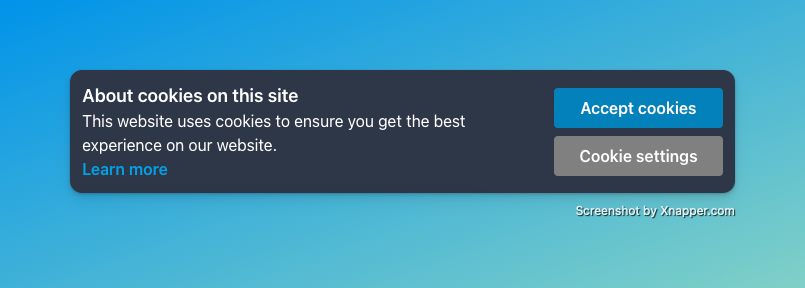
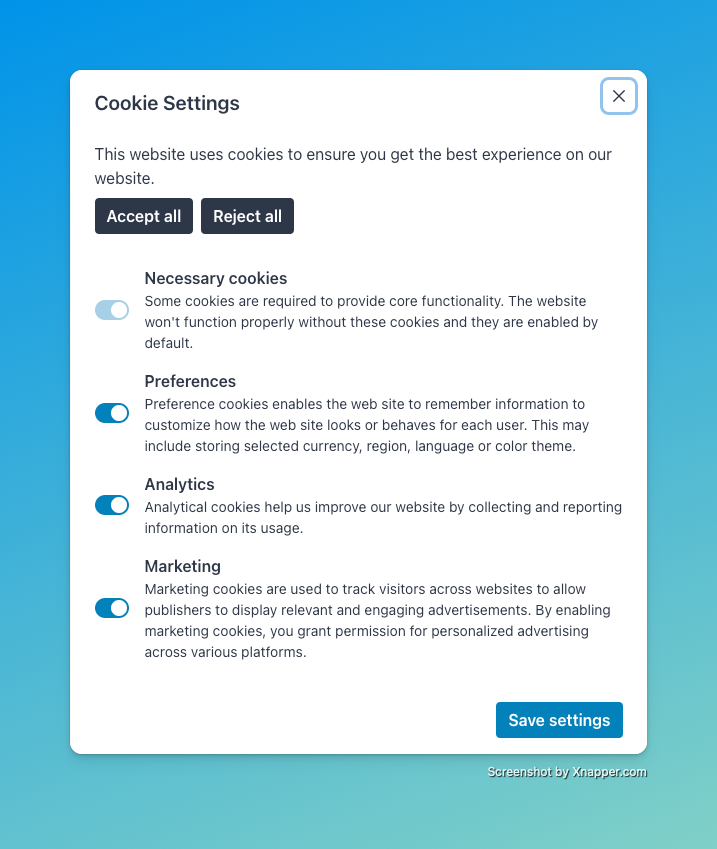

# react-cookies-consent

This is a React component that provides an easy-to-implement solution for handling cookie consent in your web application.

Write about these things:

- All the props, descriptions, default values for all components
- The ref and actions you can perform on the alert root component
- Light/dark theme
- The use of local storage
- Responsiveness for desktop and mobile
- The libraries we use, such as Chakra UI, Zustand, and Framer Motion
- Alert button click animation is disabled on text variant
- For testing, to reset the alert to show again, change the `react-cookies-consent/alert-dismissed` local storage key value to be `false`
- Modal body is required
- Check which components can accept Chakra UI attributes and note that
- Design concepts came from the design of BugSnag's cookies consent alert and
  modal (https://docs.bugsnag.com/)

Bugs:

- When changing the theme, styles do not update
- Lots of rerenders? Test performance of components via profiler

## Requirements

```
html {
  height: 100%;
  width: 100%;
}
```

## Examples

### Alert

#### Light Theme

```tsx
<CookiesConsentAlert>
  <CookiesConsentAlert.Content>
    <CookiesConsentAlert.Title text="About cookies on this site" />

    <CookiesConsentAlert.Description text="This website uses cookies to ensure you get the best experience on our website." />

    <CookiesConsentAlert.Button
      onClick={() => {
        // Handle what happens when user clicks on "Learn more" button
      }}
      text="Learn more"
      variant="text"
    />
  </CookiesConsentAlert.Content>

  <CookiesConsentAlert.Actions>
    <CookiesConsentAlert.Button
      onClick={() => {
        // Handle what happens when user accepts all cookies
      }}
      text="Accept cookies"
    />

    <CookiesConsentAlert.Button
      onClick={() => {
        // Handle what happens when user rejects all cookies
      }}
      regularButtonColor="#2D3748"
      shouldShowModal={true}
      text="Cookie settings"
    />
  </CookiesConsentAlert.Actions>
</CookiesConsentAlert>
```

<div style="display: flex; flex: 1; justify-content: center">
  
</div>

#### Dark Theme

```tsx
<CookiesConsentAlert theme="dark>
  <CookiesConsentAlert.Content>
    <CookiesConsentAlert.Title text="About cookies on this site" />

    <CookiesConsentAlert.Description text="This website uses cookies to ensure you get the best experience on our website." />

    <CookiesConsentAlert.Button
      onClick={() => {
        // Handle what happens when user clicks on "Learn more" button
      }}
      text="Learn more"
      variant="text"
    />
  </CookiesConsentAlert.Content>

  <CookiesConsentAlert.Actions>
    <CookiesConsentAlert.Button
      onClick={() => {
        // Handle what happens when user accepts all cookies
      }}
      text="Accept cookies"
    />

    <CookiesConsentAlert.Button
      onClick={() => {
        // Handle what happens when user rejects all cookies
      }}
      regularButtonColor="grey"
      shouldShowModal={true}
      text="Cookie settings"
    />
  </CookiesConsentAlert.Actions>
</CookiesConsentAlert>
```

<div style="display: flex; flex: 1; justify-content: center">
  
</div>

### Modal

#### Light Theme

```tsx
<CookiesConsentModal>
  <CookiesConsentModal.Header text="Cookie Settings" />

  <CookiesConsentModal.Body>
    <CookiesConsentModal.Text text="This website uses cookies to ensure you get the best experience on our website." />

    <CookiesConsentModal.CtaActions>
      <CookiesConsentModal.Button
        onClick={() => {
          // Handle what happens when user accepts all cookies
        }}
        regularButtonColor="#2D3748"
        text="Accept all"
      />

      <CookiesConsentModal.Button
        onClick={() => {
          // Handle what happens when user rejects all cookies
        }}
        regularButtonColor="#2D3748"
        text="Reject all"
      />
    </CookiesConsentModal.CtaActions>

    <CookiesConsentModal.CookieActions>
      <CookiesConsentModal.CookieAction
        description="Some cookies are required to provide core functionality. The website won't function properly without these cookies and they are enabled by default."
        switchDisabled={true}
        switchToggledOn={true}
        title="Necessary cookies"
      />

      <CookiesConsentModal.CookieAction
        description="Preference cookies enables the web site to remember information to customize how the web site looks or behaves for each user. This may include storing selected currency, region, language or color theme."
        onSwitchToggle={(isSwitchOn) => {
          // Handle what happens when user toggles preferences cookies
        }}
        title="Preferences"
      />

      <CookiesConsentModal.CookieAction
        description="Analytical cookies help us improve our website by collecting and reporting information on its usage."
        onSwitchToggle={(isSwitchOn) => {
          // Handle what happens when user toggles analytics cookies
        }}
        title="Analytics"
      />

      <CookiesConsentModal.CookieAction
        description="Marketing cookies are used to track visitors across websites to allow publishers to display relevant and engaging advertisements. By enabling marketing cookies, you grant permission for personalized advertising across various platforms."
        onSwitchToggle={(isSwitchOn) => {
          // Handle what happens when user toggles marketing cookies
        }}
        title="Marketing"
      />
    </CookiesConsentModal.CookieActions>
  </CookiesConsentModal.Body>

  <CookiesConsentModal.Footer>
    <CookiesConsentModal.Button
      onClick={() => {
        // Handle what happens when user saves their cookie settings
      }}
      text="Save settings"
    />
  </CookiesConsentModal.Footer>
</CookiesConsentModal>
```

<div style="display: flex; flex: 1; justify-content: center">
  
</div>

#### Dark Theme

```tsx
<CookiesConsentModal theme="dark">
  <CookiesConsentModal.Header text="Cookie Settings" />

  <CookiesConsentModal.Body>
    <CookiesConsentModal.Text text="This website uses cookies to ensure you get the best experience on our website." />

    <CookiesConsentModal.CtaActions>
      <CookiesConsentModal.Button
        onClick={() => {
          // Handle what happens when user accepts all cookies
        }}
        regularButtonColor="grey"
        text="Accept all"
      />

      <CookiesConsentModal.Button
        onClick={() => {
          // Handle what happens when user rejects all cookies
        }}
        regularButtonColor="grey"
        text="Reject all"
      />
    </CookiesConsentModal.CtaActions>

    <CookiesConsentModal.CookieActions>
      <CookiesConsentModal.CookieAction
        description="Some cookies are required to provide core functionality. The website won't function properly without these cookies and they are enabled by default."
        switchDisabled={true}
        switchToggledOn={true}
        title="Necessary cookies"
      />

      <CookiesConsentModal.CookieAction
        description="Preference cookies enables the web site to remember information to customize how the web site looks or behaves for each user. This may include storing selected currency, region, language or color theme."
        onSwitchToggle={(isSwitchOn) => {
          // Handle what happens when user toggles preferences cookies
        }}
        title="Preferences"
      />

      <CookiesConsentModal.CookieAction
        description="Analytical cookies help us improve our website by collecting and reporting information on its usage."
        onSwitchToggle={(isSwitchOn) => {
          // Handle what happens when user toggles analytics cookies
        }}
        title="Analytics"
      />

      <CookiesConsentModal.CookieAction
        description="Marketing cookies are used to track visitors across websites to allow publishers to display relevant and engaging advertisements. By enabling marketing cookies, you grant permission for personalized advertising across various platforms."
        onSwitchToggle={(isSwitchOn) => {
          // Handle what happens when user toggles marketing cookies
        }}
        title="Marketing"
      />
    </CookiesConsentModal.CookieActions>
  </CookiesConsentModal.Body>

  <CookiesConsentModal.Footer>
    <CookiesConsentModal.Button
      onClick={() => {
        // Handle what happens when user saves their cookie settings
      }}
      text="Save settings"
    />
  </CookiesConsentModal.Footer>
</CookiesConsentModal>
```

<div style="display: flex; flex: 1; justify-content: center">
  
</div>
